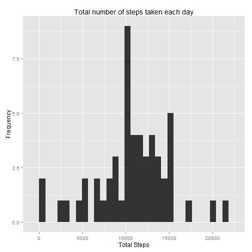
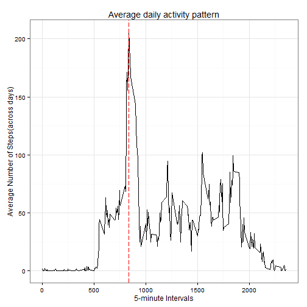
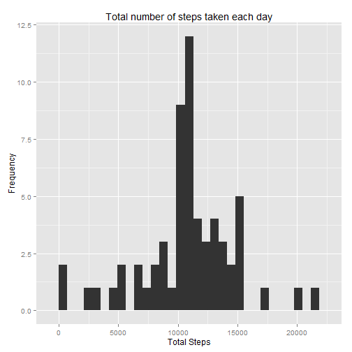
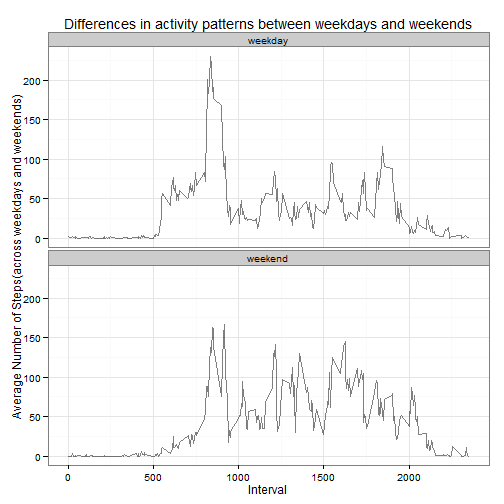

Reproducible Research: Peer Assessment 1
========================================================

## Loading and preprocessing the data

Read the input data file "activity.csv" from working directory.  


```r
activityData <- read.csv("activity.csv")
```

### Data Inspection
Inspect the sample data and class of all data columns to find out any transformations needed.  

```r
head(activityData)
```

```
##   steps       date interval
## 1    NA 2012-10-01        0
## 2    NA 2012-10-01        5
## 3    NA 2012-10-01       10
## 4    NA 2012-10-01       15
## 5    NA 2012-10-01       20
## 6    NA 2012-10-01       25
```

```r
tail(activityData)
```

```
##       steps       date interval
## 17563    NA 2012-11-30     2330
## 17564    NA 2012-11-30     2335
## 17565    NA 2012-11-30     2340
## 17566    NA 2012-11-30     2345
## 17567    NA 2012-11-30     2350
## 17568    NA 2012-11-30     2355
```

Check class of all data columns

```r
str(activityData)
```

```
## 'data.frame':	17568 obs. of  3 variables:
##  $ steps   : int  NA NA NA NA NA NA NA NA NA NA ...
##  $ date    : Factor w/ 61 levels "2012-10-01","2012-10-02",..: 1 1 1 1 1 1 1 1 1 1 ...
##  $ interval: int  0 5 10 15 20 25 30 35 40 45 ...
```
check the number records with missing data. (NA)

```r
table(is.na(activityData$steps))
```

```
## 
## FALSE  TRUE 
## 15264  2304
```

### Basic cleaning of data set
 
Change the date column from text/factor to date type.

```r
activityData$date <- as.Date(activityData$date, format="%Y-%m-%d")
```
Verify the changes

```r
str(activityData)
```

```
## 'data.frame':	17568 obs. of  3 variables:
##  $ steps   : int  NA NA NA NA NA NA NA NA NA NA ...
##  $ date    : Date, format: "2012-10-01" "2012-10-01" ...
##  $ interval: int  0 5 10 15 20 25 30 35 40 45 ...
```

## What is mean total number of steps taken per day?

Ignor the missing values in the dataset.

####Calculate the total number of steps taken per day
Use `plyr` package to summarize and find the sum of steps taken per day. Store the result in totalDaySteps data frame. Verify the result.


```r
library(plyr)
```

```
## -------------------------------------------------------------------------
## You have loaded plyr after dplyr - this is likely to cause problems.
## If you need functions from both plyr and dplyr, please load plyr first, then dplyr:
## library(plyr); library(dplyr)
## -------------------------------------------------------------------------
## 
## Attaching package: 'plyr'
## 
## The following objects are masked from 'package:dplyr':
## 
##     arrange, count, desc, failwith, id, mutate, rename, summarise,
##     summarize
```

```r
totalDaySteps <- ddply(na.omit(activityData), .(date), summarize, 
                       sumSteps = sum(steps))
head(totalDaySteps)
```

```
##         date sumSteps
## 1 2012-10-02      126
## 2 2012-10-03    11352
## 3 2012-10-04    12116
## 4 2012-10-05    13294
## 5 2012-10-06    15420
## 6 2012-10-07    11015
```


####Histogram of Steps per Day


```r
library(ggplot2)
qplot(sumSteps, data=totalDaySteps, main="Total number of steps taken each day",
      xlab="Total Steps", ylab="Frequency")
```

```
## stat_bin: binwidth defaulted to range/30. Use 'binwidth = x' to adjust this.
```

 

####Calculate and report the mean and median total number of steps taken per day


```r
mean(totalDaySteps$sumSteps)
```

```
## [1] 10766.19
```

```r
median(totalDaySteps$sumSteps)
```

```
## [1] 10765
```

## What is the average daily activity pattern?

Make a time series plot (i.e. type = "l") of the 5-minute interval (x-axis) and the average number of steps taken, averaged across all days (y-axis)


####Calculating the mean of all 5-minute intervals over all days of available data. 


```r
# Calculate the mean of 5-min intervals across all days for available data
intervalMean <- ddply(na.omit(activityData), .(interval), summarize, 
                      meanSteps = mean(steps))

head(intervalMean)
```

```
##   interval meanSteps
## 1        0 1.7169811
## 2        5 0.3396226
## 3       10 0.1320755
## 4       15 0.1509434
## 5       20 0.0754717
## 6       25 2.0943396
```

```r
tail(intervalMean)
```

```
##     interval meanSteps
## 283     2330 2.6037736
## 284     2335 4.6981132
## 285     2340 3.3018868
## 286     2345 0.6415094
## 287     2350 0.2264151
## 288     2355 1.0754717
```

```r
# checking of the mean was obtained for all intervals
nrow(intervalMean)
```

```
## [1] 288
```

####Plotting the time series plot using `intervalMean` data frame  
 

```r
# checking the max value for average number of steps for intervals
maxSteps <- intervalMean[intervalMean$meanSteps == max(intervalMean$meanSteps),]

# Plotting the time series plot
dailyPatternPlot <- ggplot(intervalMean, aes(x = interval, y = meanSteps))
dailyPatternPlot + geom_line(linetype=1) + labs(x ="5-minute Intervals") + labs(y="Average Number of Steps(across days)") + labs(title="Average daily activity pattern") + theme_bw() + geom_vline(xintercept = maxSteps$interval, color="red", linetype="longdash")
```

 


####Which 5-minute interval, on average across all the days in the dataset, contains the maximum number of steps?  
 

```r
# max value for average number of steps for intervals
intervalMean[intervalMean$meanSteps == max(intervalMean$meanSteps),]
```

```
##     interval meanSteps
## 104      835  206.1698
```


## Inputing missing values

####Calculate and report the total number of missing values in the dataset (i.e. the total number of rows with NAs)


```r
table(is.na(activityData$steps))
```

```
## 
## FALSE  TRUE 
## 15264  2304
```

####Strategy for imputing missing values
######Create a data.farme `(intervalMean)` of mean of steps for each 5-minute time interval.
######Add a new column `meanSteps` which shows the means for to the original `activityData` data.frame, which shows the mean for each associated `interval` ,by joining the two   data frames
######Then find the values all `NA` values using `is.na(imputedActivityData$steps)` and update those with average values for thet interval


```r
imputedActivityData <- join(activityData, intervalMean, by="interval")
head(imputedActivityData)
```

```
##   steps       date interval meanSteps
## 1    NA 2012-10-01        0 1.7169811
## 2    NA 2012-10-01        5 0.3396226
## 3    NA 2012-10-01       10 0.1320755
## 4    NA 2012-10-01       15 0.1509434
## 5    NA 2012-10-01       20 0.0754717
## 6    NA 2012-10-01       25 2.0943396
```


```r
# update the NAs with average values
imputedActivityData$steps[is.na(imputedActivityData$steps)] <- imputedActivityData$meanSteps[is.na(imputedActivityData$steps)]
head(imputedActivityData)
```

```
##       steps       date interval meanSteps
## 1 1.7169811 2012-10-01        0 1.7169811
## 2 0.3396226 2012-10-01        5 0.3396226
## 3 0.1320755 2012-10-01       10 0.1320755
## 4 0.1509434 2012-10-01       15 0.1509434
## 5 0.0754717 2012-10-01       20 0.0754717
## 6 2.0943396 2012-10-01       25 2.0943396
```

######Create a new dataset that is equal to the original dataset but with the missing data filled in.


```r
# Total number of steps taken each day
totalDayStepsImputed <- ddply(imputedActivityData, .(date), summarize, sumSteps = sum(steps))
head(totalDayStepsImputed)
```

```
##         date sumSteps
## 1 2012-10-01 10766.19
## 2 2012-10-02   126.00
## 3 2012-10-03 11352.00
## 4 2012-10-04 12116.00
## 5 2012-10-05 13294.00
## 6 2012-10-06 15420.00
```
######Make a histogram of the total number of steps taken each day and Calculate and report the mean and median total number of steps taken per day.


```r
# Histogram
library(ggplot2)
qplot(sumSteps, data=totalDayStepsImputed, main="Total number of steps taken each day", xlab="Total Steps", ylab="Frequency")
```

```
## stat_bin: binwidth defaulted to range/30. Use 'binwidth = x' to adjust this.
```

 


```r
# calculating the mean and median of total number of steps
mean(totalDaySteps$sumSteps)
```

```
## [1] 10766.19
```

```r
median(totalDaySteps$sumSteps)
```

```
## [1] 10765
```
######Do these values differ from the estimates from the first part of the assignment? What is the impact of imputing missing data on the estimates of the total daily number of steps?

The new imputed values are same as initial part of the assignemnt as the data was imputed using the average values for each time interval.


## Are there differences in activity patterns between weekdays and weekends?

######Create a new factor variable in the dataset with two levels – “weekday” and “weekend” indicating whether a given date is a weekday or weekend day. 

Logic for adding weekday and weekend factor levels
(1) Adding `dayType` column to data frame and update values as weekdays
(2) Create a logical vector for `weekend`.


```r
# weekday and weekend factors
weekImpActivityData <- imputedActivityData
weekImpActivityData$dayType <- "weekday"
# set up logical/test vector
weekend <- weekdays(as.Date(weekImpActivityData$date)) %in% c("Saturday", "Sunday") 
# Updating dayType to "Weekend" for which the value of logical vecor weekend is TRUE
weekImpActivityData$dayType[weekend] <- "weekend" 
# updating the datType to be a factor
weekImpActivityData$dayType <- factor(weekImpActivityData$dayType)
```

######Creating a dataset to calculate average of steps over weekdays and average of steps over weekends for each interval.


```r
# creating a dataset to calculate average of steps over weekdays and average of steps over weekends for each intervals
intervalMeanDayType <- ddply(weekImpActivityData, .(dayType, interval), summarize, meanSteps = mean(steps))
# creating teh panel plot using ggplot2
dayTypePlot <- ggplot(intervalMeanDayType, aes(interval, meanSteps))
dayTypePlot + geom_line(alpha=1/2) + facet_wrap(~ dayType, ncol=1) + labs(x ="Interval") + labs(y="Average Number of Steps(across weekdays and weekends)") + labs(title="Differences in activity patterns between weekdays and weekends") + theme_bw()
```

 

The plots shows the differences in weekend and weekday activity.
